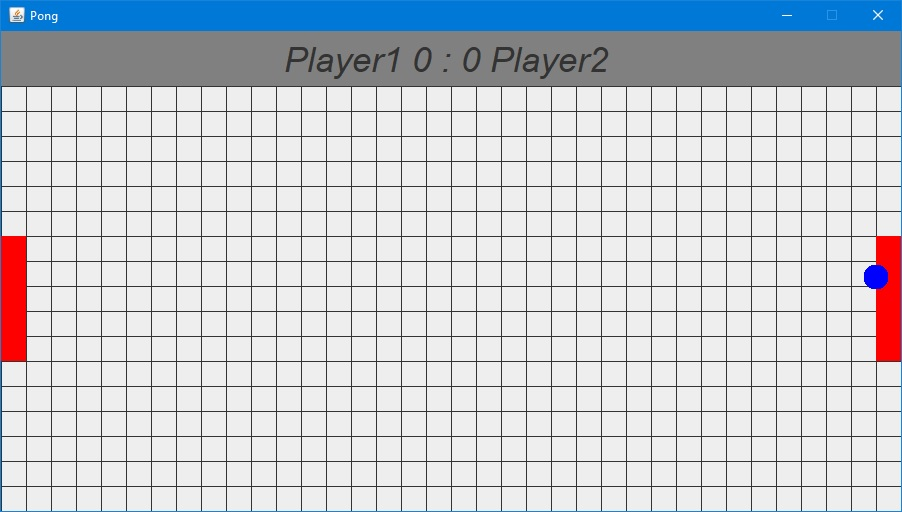

# PongGameJava

> Classic pong game written in Java.\
> Game demo can be download from https://github.com/bozo1209/PongGameJava/blob/master/exeFile/PongGameJava.exe.

## Table of Contents
* [General Information](#general-information)
* [Technologies Used](#technologies-used)
* [Setup](#setup)
* [Screenshots](#screenshots)
* [Buttons](#buttons)

## General Information
Pong game for two persons.

## Technologies Used
- Java - version 14
- Swing

## Setup
To run this project download the executable file from link above and click it. Runs only on Windows machine.

## Screenshots

# Buttons
Player one:
- 'w' - up
- 's' - down\
Player two:
- arrow up - up
- arrow down - down